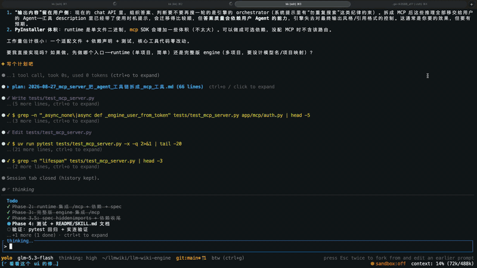

# kkagent

English | [简体中文](README.md)

[](https://github.com/Ken-u/kkagent/actions/workflows/ci.yml)
[](https://github.com/Ken-u/kkagent/actions/workflows/release.yml)
[](LICENSE)
[](https://www.rust-lang.org/)

A background-friendly, recoverable, cross-platform terminal Coding Agent written in Rust.

kkagent focuses on long-running tasks, multi-session workflows, context recovery, and local security controls.

- **Uninterrupted tasks**: press `Ctrl+B` to leave the TUI while a standalone Agent Server keeps running; the next `kk` automatically restores the session.
- **Untangled parallel work**: session tabs, `/fork`, and the BTW full-screen side-question workspace let you explore different directions without disturbing the main thread.
- **Safe and controllable**: four permission modes (`manual` / `auto` / `yolo` / `plan`) plus a system-level Bash sandbox.
- **Native cross-platform**: a single Rust binary with no Node.js runtime; Windows, macOS, and Linux (x86_64 / arm64).
- **Extensible**: built-in MCP, Skills, Hooks, Web UI, ACP, and plugin marketplaces for interactive development, remote access, and CI automation.

<p align="center">
  
</p>

[Quick Install](#quick-install) · [30-Second Quickstart](#30-second-quickstart) · [Highlights](#highlights) · [Documentation](#documentation-index)

## Why kkagent

| Concern | How kkagent handles it |
|---|---|
| Will my task die if I close the TUI? | A standalone server keeps running; the next `kk` restores the session and in-flight work. |
| Will parallel explorations tangle my context? | Session tabs, `/fork`, and BTW side-question workspaces stay isolated from the main conversation. |
| Is it safe to let the Agent run commands? | Four permission modes, a system-level Bash sandbox, privacy path policies, and audit trails. |
| Can I survive long sessions or disconnects? | Sessions, events, turn queues, and background tasks are persisted to SQLite with restart/disconnect/compaction recovery. |
| Does it fit my existing workflow? | Non-interactive mode, structured I/O, MCP, ACP, Web UI, plugins, and remote execution environments. |

### Highlights

Differentiation focuses on background running, session navigation, and terminal experience:

| Feature | Key / Command | Description |
|---|---|---|
| Session background detach | `Ctrl+B` | Quit the TUI without interrupting the session: the server and in-flight turns keep running, and the next `kk` automatically resumes. |
| Session tabs | empty input `Tab` / `←` / `→`; `Ctrl+Shift+Tab` | Cycle across the session family created by `/new` and `/fork` (real resume), with a persistent session strip at the bottom. |
| BTW full-screen side-question workspace | `/btw` · `Ctrl+G` | Fork a side question from a snapshot of the current session in a full-screen workspace; the main conversation stays untouched, and `Ctrl+G` toggles back anytime. |
| Docked todo panel | automatic | The todo list stays docked above the input and folds to fit the terminal width. |
| Transcript search | `Ctrl+F` | Full-text search across the entire transcript to locate past conclusions quickly. |
| Emacs-style line editing | `Ctrl+K` / `Ctrl+W` / `Ctrl+Y` / `Ctrl+Z` / `Ctrl+Shift+Z` | Kill line / kill word / yank / undo / redo. |
| Native scrollback | `--no-alt-screen` | Skip the alternate screen and keep the terminal's native scrollback for paging and copying. |
| Forced full redraw | `F5` | Fix torn frames and ghost characters over SSH or older terminals. |
| Non-interactive orchestration | `--max-turns` · `--input-format` | Cap the number of turns per task (exit code 3 when exceeded); drive the agent via stream-json input. |
| Shell completions | `kkagent completions` | Generate completion scripts for bash / zsh / fish / PowerShell. |

On top of that, kkagent also ships: system-level Bash sandboxing (Linux Bubblewrap / macOS Seatbelt / Windows Job Object), standalone server lifecycle management (`kkagent server stop` / `server status`), turn queueing (press `Enter` while running to queue input for the next turn), auto-folded large pastes, Emacs-style line editing, mouse wheel scrolling with click-and-drag selection copy, and `F5` forced full redraw for SSH or older terminals.

### Use cases

- Long-running Coding Agent tasks that should keep going after you leave the terminal.
- Multiple sessions, branches, or exploration directions without cross-contaminating context.
- Explicit permission approval, system sandboxing, credential protection, and audit trails.
- Single-binary deployment on Windows, macOS, Linux, or remote development machines.
- Scripted, CI, Web UI, ACP, MCP, or plugin-driven Agent workflows.

## Quick Install

### macOS / Linux (recommended)

```bash
curl --proto '=https' --tlsv1.2 -fsSL https://raw.githubusercontent.com/Ken-u/kkagent/main/install.sh | sh
```

The installer detects macOS/Linux and x86_64/arm64, downloads the latest Release, and verifies its SHA-256 checksum. On Linux it defaults to the musl static build (`unknown-linux-musl`), so no system OpenSSL is required. It uses `/usr/local/bin` when writable and otherwise falls back to `~/.local/bin`. You can also pin the directory, version, or glibc artifact:

```bash
curl --proto '=https' --tlsv1.2 -fsSLO https://raw.githubusercontent.com/Ken-u/kkagent/main/install.sh
KKAGENT_INSTALL_DIR="$HOME/bin" KKAGENT_VERSION=<version> sh install.sh
KKAGENT_TARGET=x86_64-unknown-linux-gnu sh install.sh
```

The installer also adds `kkagent-update`; run that command later to upgrade in the original installation directory. The TUI checks GitHub Releases in the background at most once every 24 hours and only displays a notice; set `[ui] check_updates = false` to disable it.

### Manual download

Download the archive for your platform from [GitHub Releases](https://github.com/Ken-u/kkagent/releases/latest), verify it against `SHA256SUMS`, extract it, and place `kkagent` on your `PATH`.

Current release matrix:

| Platform | Architecture | Artifact |
|---|---|---|
| macOS | x86_64 / arm64 | `kkagent-x86_64-apple-darwin.tar.gz` / `kkagent-aarch64-apple-darwin.tar.gz` |
| Linux (musl, static) | x86_64 / arm64 | `kkagent-x86_64-unknown-linux-musl.tar.gz` / `kkagent-aarch64-unknown-linux-musl.tar.gz` |
| Linux (glibc) | x86_64 / arm64 | `kkagent-x86_64-unknown-linux-gnu.tar.gz` / `kkagent-aarch64-unknown-linux-gnu.tar.gz` |
| Windows | x86_64 / arm64 | `kkagent-x86_64-pc-windows-msvc.zip` / `kkagent-aarch64-pc-windows-msvc.zip` |

### Windows (PowerShell)

```powershell
irm https://raw.githubusercontent.com/Ken-u/kkagent/main/install.ps1 | iex
```

Or download first and then execute:

```powershell
curl -fsSLO https://raw.githubusercontent.com/Ken-u/kkagent/main/install.ps1
.\install.ps1
```

The script installs to `%LOCALAPPDATA%\Programs\kkagent` by default. Override it with an environment variable:

```powershell
$env:KKAGENT_INSTALL_DIR = "$env:USERPROFILE\bin"; .\install.ps1 -Version <version>
```

The installer also adds `kkagent-update.ps1`; run it later to upgrade in the original installation directory.

## 30-Second Quickstart

kkagent supports Anthropic, Kimi, OpenAI / OpenAI Responses, Google Gemini, and OpenAI-compatible endpoints; configure multiple models and switch per session.

1. Initialize the config (interactive wizard; Kimi hosted-account login is also available there):

```bash
kkagent init
```

Or create `~/.kkagent/config.toml` manually:

```toml
default_model = "kimi-k2-0711-preview"

[providers.kimi]
type = "kimi"
base_url = "https://api.moonshot.cn/v1"
# Recommended: reference the key via an env var instead of committing it
api_key_env = "KIMI_API_KEY"

[models."kimi-k2-0711-preview"]
provider = "kimi"

# Optional: use after the primary exhausts its normal per-step retries
# fallback_model = "backup-model"

[permissions]
default_permission_mode = "manual"
```

> Prefer injecting keys via environment variables (`api_key_env`) or `kkagent auth login` instead of storing them in plain text. See [docs/configuration.md](docs/configuration.md) for all fields.

2. Launch the TUI:

```bash
kkagent
```

The `kkagent` binary is also installed as a `kk` symlink in the same directory, so typing `kk` is equivalent to `kkagent`.

3. Run a one-off task non-interactively:

```bash
kkagent -y -p "Read ./Cargo.toml and count workspace members"
```

Or using the short alias:

```bash
kk -y -p "Read ./Cargo.toml and count workspace members"
```

See [docs/cli-and-tui.md](docs/cli-and-tui.md) for more.

## Core Features

- **Native Rust**: a single binary with no Node.js runtime dependency and native cross-platform support.
- **Agent runtime**: multi-turn conversation, tool-call loop, automatic context compression, token budget and turn budget management.
- **TUI / Server decoupling**: by default the TUI and Agent Server run in-process via memory transport; connect to a standalone server over UDS / TCP and use `Ctrl+B` to leave the session running in the background.
- **Safe execution**: four permission modes plus Linux Bubblewrap, macOS Seatbelt, and Windows Job Object sandboxes with read-only and network-restricted policies.
- **Reliable recovery**: sessions, events, turn queues, background tasks, and checkpoints are persisted to `~/.kkagent/transcripts.db`, supporting `--resume`, reconnects, and cross-restart recovery.
- **Multi-session workflows**: session tabs, `/new`, `/fork`, BTW side questions, a docked todo panel, and transcript search for long-running tasks.
- **Automation and integrations**: headless / CI structured I/O, Web UI, ACP, plus local and SSH remote execution environments.
- **Extensible tool system**: built-in file, search, shell, task, plan, web, and media tools, with MCP, Skills, Hooks, and plugin marketplaces.
- **Observability**: structured logging, HTTP audit logs, and configurable telemetry events.

<details>
<summary><strong>Runtime & engineering details</strong></summary>

- **Background & multi-session**: workspace session registry with cross-directory resume; subagent session tabs; AgentSwarm parallel subagents (timeout / rate-limit recovery, backgroundable); reconnect restores BTW, prompt queues, approvals, and live streams.
- **Web UI**: dark theme, Markdown rendering, mobile sidebar, model picker, per-turn Timeline diffs, plan review, and plugin panels; hot-attach to a running server via `--http`.
- **Tool system**: progressive tool disclosure, deferred MCP schema advertisement, BM25 fuzzy suggestions for unknown tools; stream-event coalescing and transcript layout caching for very large workspaces; a unified background-task panel (`/tasks` + `/ps`).
- **LLM engineering**: Anthropic / DeepSeek prompt caching with cache-hit stats; `compaction_model`, per-model thinking effort, `api_key_env`, configurable retry backoff, streaming first-token timeout gating, and cross-chunk UTF-8 reassembly.
- **Security & sandboxing**: S0–S2 privacy path policies; declarative toolchain sandbox profiles; Once / Turn / Session / Workspace grant scopes; `shell -c` bypass detection, always-approvals persistence, credential-directory deny, and security audit trails.
- **Runtime reliability**: disk-persisted turn checkpoints; undo across restarts and compaction; per-message transcript persistence with orphaned tool-use repair; oversized tool results spilled to disk with trash archiving; automatic retry of malformed tool calls.
- **Context & isolation**: budget-safe payload projection, `/compact` auto-compaction, `/context` per-section token breakdown; a dependency-free bash AST tokenizer/parser; subagents in dedicated git worktrees with cross-session write-conflict warnings and test-command isolation.

</details>

## Architecture Overview

The workspace contains 16 crates:

| Crate | Description |
|---|---|
| `kkagent` | Main binary entrypoint, CLI / TUI launcher. |
| `kkagent-protocol` | Protocol types, messages, and error definitions shared across crates. |
| `kkagent-rpc` | RPC transport layer (memory / UDS / TCP). |
| `kkagent-config` | TOML config loading, validation, and environment variable overrides. |
| `kkagent-llm` | LLM provider abstraction, stream parsing, token counting. |
| `kkagent-core` | Agent main loop, context projection, permission chain, plan review. |
| `kkagent-tools` | Built-in tool implementations and registry. |
| `kkagent-mcp` | MCP Client / Server support. |
| `kkagent-client` | High-level client wrapper. |
| `kkagent-tui` | Terminal user interface. |
| `kkagent-di` | Dependency injection container. |
| `kkagent-wire` | Serialization and message encoding/decoding. |
| `kkagent-telemetry` | Telemetry events and configurable upload. |
| `kkagent-acp` | Agent-Client Protocol / long-connection protocol implementation. |
| `kkagent-oauth` | OAuth / token management. |
| `kkagent-kaos` | Chaos and stress-testing helpers. |

### Built-in Tool List

| Category | Tool | Description |
|---|---|---|
| File I/O | `Read` / `Write` / `Edit` / `Glob` | Read, write, line-level edit, batch file discovery. |
| Search | `Grep` | Regex search with context and multi-file filtering. |
| Execution | `Bash` | Sandboxed command execution with permission policies and background shells. |
| Task management | `TodoList` / `Goal` / `Task` | TODO tracking, multi-turn goals, background sub-Agent tasks. |
| Interaction | `AskUserQuestion` / `SelectTools` | User confirmation and tool selection. |
| Context | `Skill` | Load and execute skill templates. |
| Planning | `Plan` | Tools related to plan mode. |
| Scheduling | `CronCreate` / `CronDelete` / `CronList` | Schedule prompts for future execution. |
| Web / Media | `Web` / `Media` | Web fetching and media file reading. |

Tool declarations and permission policies are managed centrally by `kkagent-tools`; new tools automatically enter the permission evaluation flow.

## Permission Modes

| Mode | Behavior |
|---|---|
| `manual` | Every write, Bash, or dangerous command triggers a confirmation prompt. |
| `auto` | Read-only tools and low-risk operations pass automatically; file writes and Bash still require approval. |
| `yolo` | All operations are auto-approved; suitable for automation scripts and trusted environments. |
| `plan` | The Agent generates a plan first; the user reviews it before execution; read-only by default. |

Switch at startup with `-y/--yolo`, `--auto`, or `--plan`; switch dynamically in the TUI with `/yolo`, `/auto`, or `/plan`. See [docs/tools-and-permissions.md](docs/tools-and-permissions.md) for details.

## Configuration Reference

kkagent reads a single TOML config: `--config <path>` takes precedence, otherwise `~/.kkagent/config.toml` is used. Common commands:

```bash
kkagent config show
kkagent config get sandbox.mode
kkagent config set sandbox.network false
kkagent config preset safe
```

For troubleshooting, `kkagent --disable-sandbox` disables the Bash OS sandbox and resource limits for the current process without modifying the config. Use it only inside a controlled container or VM.

For the full list of config options, providers, models, MCP, hooks, and plugin marketplaces, see [docs/configuration.md](docs/configuration.md).

### Plugin marketplaces

`/plugins` opens plugin management (installed list, marketplace browse, install/update/enable/disable). Set the default catalog with `plugin_marketplace` and extra catalogs with `plugin_marketplaces`:

```toml
plugin_marketplace = "https://plugins.example.com/marketplace.json"
plugin_marketplaces = [
  "http://git.example.com/org/kk-plugins",
  { name = "team", source = "/data/kk-plugins/marketplace.json" },
]
```

`KKAGENT_PLUGIN_MARKETPLACE_URL` overrides only the default catalog. GitHub-compatible forges (including GitBucket) are supported: a repo homepage or `tree/<ref>/<plugin-dir>` downloads the archive and extracts that subdirectory. See [docs/extensions.md](docs/extensions.md) for details.

## Documentation Index

- [Getting Started](docs/getting-started.md)
- [Configuration Reference](docs/configuration.md)
- [CLI and TUI](docs/cli-and-tui.md)
- [Tools and Permissions](docs/tools-and-permissions.md)
- [Agent Server API](docs/server-api.md)
- [Troubleshooting](docs/troubleshooting.md)
- [Releases and Packages](docs/releases.md)
- [Security Design](docs/security.md)
- [Architecture Design](docs/architecture.md)
- [Extension Mechanisms](docs/extensions.md)
- [Operations and Monitoring](docs/operations.md)
- [Development and Testing](docs/development.md)

## Acknowledgments

kkagent's interaction design and runtime model draw inspiration from the [kimi-code](https://github.com/MoonshotAI/kimi-code) CLI. It is an independent Rust implementation and does not reuse kimi-code's code.

## Development

```bash
git clone https://github.com/Ken-u/kkagent.git
cd kkagent

cargo build --release --workspace
./target/release/kkagent --help

cargo fmt --all -- --check
cargo clippy --workspace --all-targets -- -D warnings
cargo test --workspace --all-targets
```

Please read [docs/development.md](docs/development.md) for commit conventions and cross-platform build instructions before submitting changes.

## License

MIT — see [LICENSE](LICENSE).
